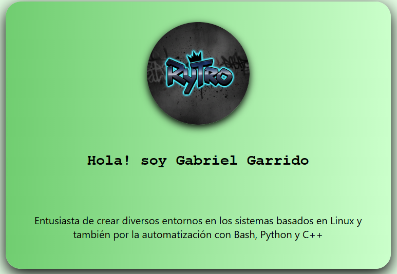

# Portafolio Web


<br>

<mark>**¡Bienvenido a mi portafolio web!**</mark>

En este portafolio, busco dar a conocerme en el campo laboral y mostrar mis habilidades técnicas, además de los proyectos que he hecho en mi proceso de aprendizaje.

## Tecnologías utilizadas
- **HTML5**: Estructura semántica.
- **CSS3**: Uso de grid y flexbox, diseño personalizado, diseño responsive (tablet y celulares).
- **Git/GitHub**: Actualización mediante commits y alojado en GitHub pages.
- **JS**: Actualización año a año de forma automática.

## Instalación y cómo ejecutar
1. Clonar el repositorio
```git clone https://github.com/RyTr01/Ev1-Front-End-INACAP```

2. Una vez clonado el repositorio, puedes abrir el archivo `index.html` con tu navegador de preferencia

### Previsualización sin instalar
<a style="color: green;" href="https://rytr01.github.io/" target="_blank">Ver portafolio en vivo!</a>

## Estructura de proyecto
```
├── index.hmtl
├── source/
│   ├── images/
│   ├── css/
└── README.md
```

## Lincencia

Licencia MIT
